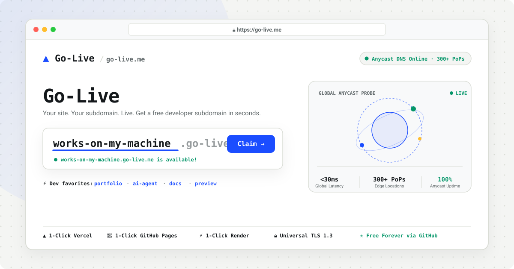

<div align="center">

# ▲ Go-Live.me

### Instant, Globally-Distributed Anycast Subdomains for Developers.

**Go from `localhost` to a live, production-grade `.go-live.me` domain in under 10 seconds.**

<br />

[](https://go-live.me)

<br />

[](#-release-highlights)
[](docs/ARCHITECTURE.md)
[](docs/ARCHITECTURE.md)
[](docs/ARCHITECTURE.md)
[](docs/PROVIDERS.md#1--vercel-1-click-integration)
[](docs/PROVIDERS.md#2--github-pages-1-click-integration)
[](docs/PROVIDERS.md#3--render-1-click-integration)
[](https://go-live.me/llms.txt)

</div>

---

## ⚡ What is Go-Live?

**Go-Live** gives every developer a permanent, high-performance edge slot under `*.go-live.me`. 

No credit cards, no complex DNS dashboards, and no configuration headaches. Pick a subdomain, connect with GitHub, star the project to unlock your slot, and route your deployments worldwide in 1 click.

---

## 📚 Documentation Index

To keep this guide concise, comprehensive documentation has been organized into specialized modules:

| Document | Description |
|:---|:---|
| 🚀 **[Hosting Providers Guide](docs/PROVIDERS.md)** | Step-by-step 1-click guides for **Vercel**, **GitHub Pages**, **Render**, and **Custom DNS**. |
| 🏛️ **[Architecture & Network](docs/ARCHITECTURE.md)** | 300+ Anycast Edge PoPs, TLS 1.3 Universal SSL, and the Progressive Verification Ladder. |
| 🌟 **[Community & Showcase](docs/COMMUNITY.md)** | Submit your live project to the community showcase, suggest features, or report bugs. |
| 🤖 **[LLMs & AI Context](https://go-live.me/llms.txt)** | Standardized `llms.txt` and `llms-full.txt` context specification for AI search engines & agents. |
| 🤝 **[Contributing Guide](CONTRIBUTING.md)** | Open source contribution workflow, developer proposal process, and repository access. |

---

## 🚀 3-Step Quickstart

```
  1. Pick Name          2. Star on GitHub         3. 1-Click Route
 [mysite.go-live.me] ──► [Unlock Free Slot] ──► [Vercel / GitHub Pages / Render / VPS]
```

1. **Claim Your Subdomain**: Search availability on **[go-live.me](https://go-live.me)** (sub-0.1ms DNS check).
2. **Unlock Slot**: Authenticate with GitHub and star the repository to claim your permanent slot.
3. **Route in 1 Click**: Select your hosting provider (**Vercel**, **GitHub Pages**, **Render**, or **Custom VPS**).

---

## 🌐 Supported Hosting Integrations

| Provider | Integration Type | Automated Capabilities |
|:---|:---|:---|
| **▲ Vercel** | `1-Click OAuth / PAT` | Automated project alias, `_vercel` TXT challenge DNS provisioning, and CNAME binding. |
| **🐙 GitHub Pages** | `1-Click OAuth` | Automated repository selection, `CNAME` file configuration in repository settings, and Anycast routing. |
| **⚡ Render** | `1-Click API Token` | Automated Web Service discovery, custom domain registration, and Cloudflare DNS linking. |
| **🌐 Custom DNS** | `CNAME / A Record` | Point to any server worldwide: **Fly.io**, **Railway**, **Cloudflare Tunnels**, or **IPv4 VPS**. |

👉 *For detailed setup guides, see the **[Hosting Providers Guide](docs/PROVIDERS.md)**.*

---

## ✨ Core Features

- **🌐 300+ Anycast Edge Locations**: Sub-30ms global response latency and automatic DDoS mitigation.
- **🔒 Universal TLS 1.3 SSL**: Automated SSL provisioning and renewal with full HTTP/2 support.
- **📊 Real-Time DNS Telemetry**: Multi-region Anycast health probing and latency inspection directly from your dashboard.
- **🛡️ Fair-Use Protection**: 1 permanent free slot per developer with a 2-hour fair-use release cooldown.
- **🤖 AI Agent Readable**: Complete `llms.txt` specification at `https://go-live.me/llms.txt`.

---

## 💬 Community, Feedback & Issue Templates

We welcome feedback, project showcases, platform integrations, and bug reports!

- 💬 **[Share Feedback](https://github.com/shanmukhasaireddy13/Go-Live/issues/new?template=feedback.yml)** — Suggest UX improvements or DX features.
- 🌟 **[Showcase Your Project](https://github.com/shanmukhasaireddy13/Go-Live/issues/new?template=community_showcase.yml)** — Get your live `.go-live.me` website featured.
- 🐛 **[Report a Bug](https://github.com/shanmukhasaireddy13/Go-Live/issues/new?template=bug_report.yml)** — Report DNS routing or verification issues.
- 💡 **[Request a Feature](https://github.com/shanmukhasaireddy13/Go-Live/issues/new?template=feature_request.yml)** — Propose new providers (Netlify, Coolify, Workers).
- 🤝 **[Apply to Contribute](https://github.com/shanmukhasaireddy13/Go-Live/issues/new?template=contribute.yml)** — Apply for developer repository access.

---

## 📄 License & Copyright

&copy; 2026 Go-Live.me. All rights reserved. Built with ❤️ for developers worldwide.
